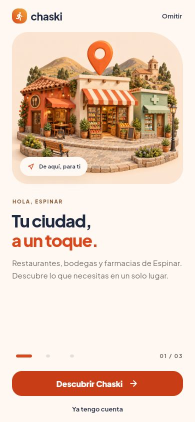
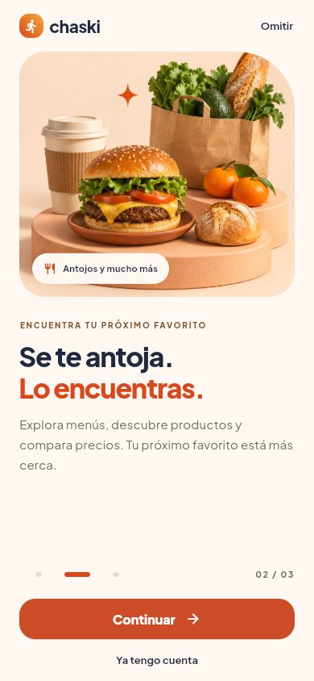
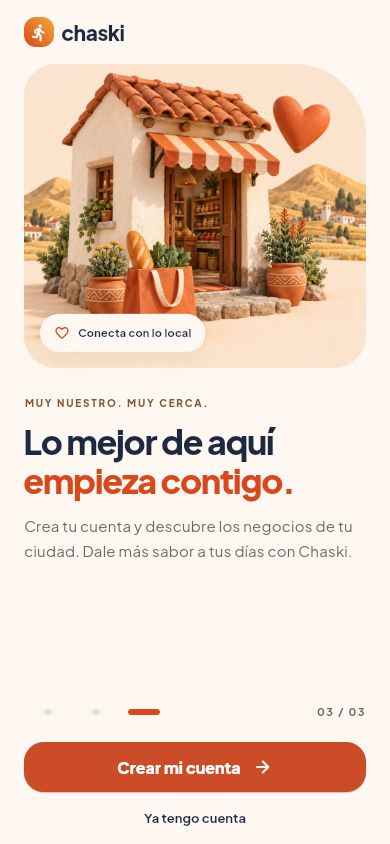

# Apamuy · Tu ciudad, a un toque

Propuesta e implementación del onboarding · 23 de septiembre de 2026.

## Producto y público

Apamuy conecta a clientes con restaurantes, bodegas, farmacias y otros negocios de su ciudad. Espinar es la primera ciudad del catálogo; la arquitectura contempla expansión a otras ciudades. La identidad existente es andina, cálida y moderna: achiote, quinua y noche andina, con tipografía Plus Jakarta Sans.

El público se define por una necesidad, sin inventar un perfil demográfico: personas de Espinar que quieren resolver compras cotidianas y descubrir opciones locales desde el teléfono. Para ellas, el onboarding debe responder rápidamente qué encontrarán, por qué les resulta útil y cómo empezar.

Fuentes revisadas: [arquitectura y roadmap](ARQUITECTURA.md), README raíz y mobile, router, preferencias de onboarding, autenticación, home, catálogo, detalle de producto y pedidos. Los README todavía describen etapas anteriores; para determinar el estado actual se contrastaron con el código.

El flujo implementado es: restaurar sesión → onboarding en la primera visita → autenticación → home → categorías/búsqueda → negocio → producto y sus opciones. La app usa datos de prueba por defecto. El carrito aún muestra un aviso de fase futura y pedidos tiene un estado vacío. Compra, pagos y seguimiento completo pertenecen al roadmap. Por eso esta versión comunica descubrimiento y catálogo; el mensaje de delivery debe reforzarse cuando el recorrido de compra esté operativo.

## Diagnóstico breve

| Hallazgo anterior | Consecuencia | Cambio |
| --- | --- | --- |
| Tres iconos grandes sobre círculos casi idénticos | Baja diferenciación; poca conexión con la vida local | Tres escenas propias con una secuencia: ciudad, antojo y comunidad |
| Títulos y cuerpos centrados con estructura uniforme | Lectura monótona y jerarquía poco expresiva | Titulares breves alineados a la izquierda, segunda línea de acento y mucho espacio |
| «Llega al toque» y «sabes en todo momento dónde está» | Promesas que la versión actual no puede demostrar | Beneficios del catálogo que sí se pueden explorar |
| «Tarjeta, Yape y Plin muy pronto» | Carga cognitiva y énfasis en funcionalidades ausentes | Mensaje centrado en el valor disponible |
| «Empezar» desemboca en login | La persona nueva debe buscar cómo registrarse | «Crear mi cuenta» abre registro; «Ya tengo cuenta» abre login |
| Sin tratamiento explícito del guardado pendiente/fallido | Doble pulsación o salida poco clara si falla el almacenamiento | Bloqueo durante guardado, feedback y reintento |
| Columna rígida y progreso solo visual | Fragilidad con poco espacio y menor claridad accesible | Scroll adaptativo, controles etiquetados y movimiento reducido |

## Concepto

**Tu ciudad, a un toque.** Una bienvenida que se siente cercana y despierta curiosidad: primero reconozco mi ciudad, luego encuentro algo que me interesa y finalmente veo una invitación clara a entrar.

Tres pantallas mantienen el recorrido breve. Cada una cumple una función distinta. No hay autoplay, permisos anticipados, descuentos inventados, cifras de usuarios ni tiempos de entrega sin respaldo. Se puede omitir desde las dos primeras pantallas y entrar a una cuenta existente desde cualquiera.

## Estructura y copy implementados

| Pantalla | Intención | Antetítulo | Título | Subtítulo | CTA principal |
| --- | --- | --- | --- | --- | --- |
| 1 · Ciudad | Entender la oferta y reconocer Espinar | HOLA, ESPINAR | **Tu ciudad, a un toque.** | Restaurantes, bodegas y farmacias de Espinar. Descubre lo que necesitas en un solo lugar. | Descubrir Apamuy |
| 2 · Descubrimiento | Despertar interés y mostrar utilidad | ENCUENTRA TU PRÓXIMO FAVORITO | **Se te antoja. Lo encuentras.** | Explora menús, descubre productos y compara precios. Tu próximo favorito está más cerca. | Continuar |
| 3 · Comunidad | Convertir la curiosidad en registro | MUY NUESTRO. MUY CERCA. | **Lo mejor de aquí empieza contigo.** | Crea tu cuenta y descubre los negocios de tu ciudad. Dale más sabor a tus días con Apamuy. | Crear mi cuenta |

Los sellos de las ilustraciones son «De aquí, para ti», «Antojos y mucho más» y «Conecta con lo local». «Compara precios» se refiere a consultar los precios del catálogo; no se presenta un comparador automático.

**Navegación:** deslizar o pulsar el CTA avanza; los indicadores permiten ir a cualquier paso; volver desde los pasos 2 y 3 retrocede un paso. «Omitir» y «Crear mi cuenta» guardan el onboarding como visto y abren registro. «Ya tengo cuenta» guarda ese mismo estado y abre login. No se inicia sesión ni se crea una cuenta automáticamente. En visitas siguientes se conserva el comportamiento del router existente.

## Dirección visual

- **Estilo:** pequeñas escenas tridimensionales con acabados táctiles, luz cálida y sombras suaves. Una maqueta de comercios para el primer contacto, un bodegón apetitoso para la variedad y una tienda con bolsa/corazón para la conexión local. Las escenas son conceptuales, no fotografías de establecimientos reales de Espinar.
- **Color:** fondo crema `#FFF8F2`, texto noche andina `#1E2940`, títulos en achiote `#D9481C`, detalles en quinua y salvia. El botón claro utiliza achiote más profundo `#C83D15` para mejorar el contraste con texto blanco. El modo oscuro conserva superficies oscuras, texto claro y acento `#FF6B3D`.
- **Tipografía:** Plus Jakarta Sans, titulares de 30–34 dp y peso 800; cuerpos de 15 dp con interlínea generosa. Fuente variable incluida localmente, con licencia OFL. La fuente de esta pantalla no depende de una descarga de Google Fonts.
- **Composición:** marca y omisión arriba; ilustración protagonista con una esquina asimétrica; sello contextual; antetítulo, título y descripción; progreso y acción al alcance del pulgar. Ancho máximo de 520 dp para que el contenido siga siendo legible en pantallas grandes.
- **Iconografía:** Material Rounded/Outlined del proyecto, reservada para categorías, afecto local y navegación. Las ilustraciones aportan carácter sin reemplazar texto funcional.
- **Adaptación:** SafeArea; texto del sistema sin limitar su escala; contenido y acciones desplazables con poco alto o texto grande. El logotipo conserva su proporción como marca. Ilustraciones decorativas excluidas del lector de pantalla; títulos semánticos, progreso anunciado y controles de paso de 48 × 48 dp.

## Movimiento e interacción

| Elemento | Comportamiento implementado | Propósito |
| --- | --- | --- |
| Ilustración al montarse | Opacidad 0 → 1, entrada de 16 dp y escala 0,97 → 1 en 650 ms, easeOutCubic | Una bienvenida suave, sin retrasar la lectura |
| Cambio por CTA/indicador | Deslizamiento horizontal de 420 ms, easeInOutCubic | Continuidad espacial entre los pasos |
| Progreso | Indicador activo de 32 dp frente a 8 dp; transición de 240 ms | Confirmar el avance |
| Pulsación | Feedback Material de presión, foco y hover | Hacer evidente qué se puede tocar |
| Finalización | «Un momento…», indicador de carga y controles bloqueados mientras se guarda | Evitar acciones duplicadas y mostrar respuesta |
| Error de guardado | Mensaje claro y acciones habilitadas para reintentar | Recuperación sin abandonar el recorrido |
| Movimiento reducido | Sin animación de entrada ni desplazamiento programático; indicadores instantáneos | Respetar la preferencia de accesibilidad |

No se añaden animaciones en bucle, partículas, reproducción automática ni vibraciones repetitivas. Se priorizan la lectura y el control de la persona.

## Assets y vistas

Tres ilustraciones generadas para esta experiencia e incluidas en `mobile/assets/images/onboarding/`: `neighborhood.png`, `favorites.png` y `community.png`. Pesan aproximadamente 6,1 MiB en total, se incluyen en el bundle y no requieren red. No se añadieron dependencias de animación ni servicios externos al onboarding.

Capturas de los widgets reales ejecutándose en Flutter web a 390 × 844:

| Descubrir | Encontrar | Crear cuenta |
| --- | --- | --- |
|  |  |  |

[Ejemplo en modo oscuro](onboarding/01-descubrir-dark.png).

## Implementación y revisión

La modificación se concentra en `onboarding_page.dart`, los widgets `onboarding_content.dart` y `onboarding_hero.dart`, las declaraciones de assets/fuente en `pubspec.yaml` y las pruebas del onboarding. No se modifican las pantallas de login, registro, home ni compra.

Para revisar el diseño repetidamente sin alterar el estado persistente ni invertir condiciones del router:

```sh
cd mobile
flutter run -d chrome -t tool/onboarding_preview.dart
```

La entrada de preview utiliza los mismos widgets, temas y router, con preferencias en memoria y datos de prueba. Recargar vuelve al inicio. En web se puede añadir `?theme=dark` antes del fragmento `#/onboarding`. Esta entrada es solo para revisión local; `lib/main.dart` conserva el arranque normal.

Validación: 46 pruebas de la app aprobadas, incluidas 12 del onboarding. Cubren registro y login mediante el router real, omisión, estado visto, swipe, retroceso, salto por indicadores, guardado pendiente/fallido, 320 × 568, texto al 200 %, horizontal y modo oscuro, además del salto sin animación con movimiento reducido. El análisis estático de los archivos nuevos/modificados no presenta incidencias. El análisis global detecta dos avisos previos de llaves en el router, fuera del cambio de diseño.

La revisión visual se realiza en Flutter web. No se ha ejecutado en un dispositivo físico Android/iOS. Las mejoras de conversión son una hipótesis de diseño: conviene observar finalización, omisión y registros completados antes de atribuirles un incremento medido.
